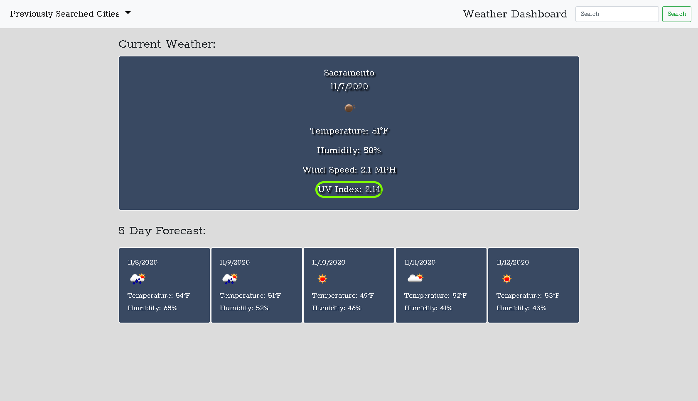

# Weather-Dashboard

* a weather dashboard that will present user with current weather as well as a 5 day forcast of searched city
* uses open weather map API 
* uv index data is color coded:
green = low
 
yellow = medium
 
orange = high
 
red = very high
 
purple = extreamly high

* under prevously searched cities the user will find a list of all of the previous searches
* when a city from the list is clicked the weather data for that area will be displayed
* users last search is stored and will load in dashboard when application is opened

* [link](https://wattierdan.github.io/Weather_Dashboard/) to deployed application

